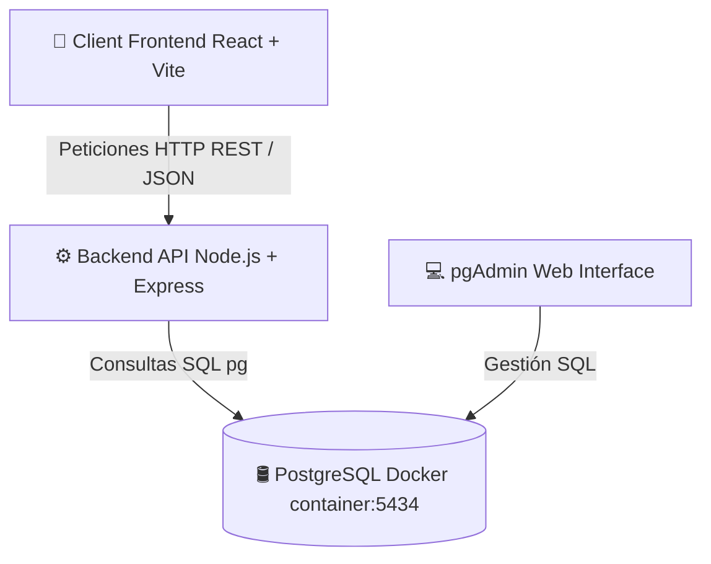

<div align="center">

# 🎵 ENSAMBLIA

### *La plataforma definitiva para conectar músicos, bandas y proyectos musicales*

[](https://nodejs.org/)
[](https://expressjs.com/)
[](https://react.dev/)
[](https://www.postgresql.org/)
[](https://vitejs.dev/)

---

</div>

## 📌 Visión del Proyecto

**Ensamblia** nace para solucionar la fragmentación en la búsqueda de talentos musicales y la gestión de proyectos artísticos. Permite a músicos crear su perfil profesional, filtrar ofertas por instrumentos/géneros musicales/localización, comunicarse en tiempo real mediante chats internos y publicar anuncios de servicios o búsqueda de integrantes.

> 👥 **Equipo Creador**: Maite, Marga, Raquel y Luis.

---

## 🏗️ Arquitectura y Tecnologías

El sistema adopta una arquitectura desacoplada de 3 capas:



| Capa | Tecnología | Descripción |
| :--- | :--- | :--- |
| **Frontend** | React 19 + Vite | Interfaz Single Page Application (SPA), React Router v7 y Axios. |
| **Backend** | Node.js + Express 5 | API REST modular estructurada en Rutas, Controladores y Modelos. |
| **Base de Datos**| PostgreSQL 16 (Docker) | Esquema relacional optimizado con semilla inicial de +500 usuarios. |

---

## 🚀 Inicio Rápido (Desarrollo Local)

### 1. Prerrequisitos
- **Node.js** (v18+)
- **Docker Desktop** (Debe estar iniciado)

### 2. Levantar los Servicios

```bash
# 1. Clonar el repositorio
git clone https://github.com/tu-usuario/ensambliaAPI.git
cd ensambliaAPI

# 2. Iniciar la Base de Datos (Docker)
docker-compose up -d

# 3. Arrancar el Backend (Puerto 3000)
npm install
npm run dev

# 4. Arrancar el Frontend (Puerto 5173 - En otra terminal)
cd frontend
npm install
npm run dev
```

---

## 📂 Estructura del Repositorio

```text
ensambliaAPI/
├── 📄 GUIA_EQUIPO.md       # Documentación técnica completa para desarrolladores
├── 🐳 docker-compose.yml   # Configuración contenedor PostgreSQL + pgAdmin
├── 📂 src/                 # Código fuente del Backend (API REST)
│   ├── 📄 app.js           # Servidor principal y endpoints de Express
│   ├── 📄 db.js            # Pool de conexión PostgreSQL (pg)
│   ├── 📂 controllers/     # Lógica de negocio por entidad
│   ├── 📂 models/          # Consultas SQL a PostgreSQL
│   └── 📂 routes/          # Definición de rutas (/api/auth, /api/anuncios...)
└── 📂 frontend/            # Código fuente del Frontend (React.js)
    ├── 📂 src/api/         # Cliente Axios centralizado
    ├── 📂 src/components/  # Componentes reutilizables (Navbar, Cards, Filtros)
    ├── 📂 src/pages/       # Vistas de la aplicación (Home, Anuncios, Perfil, Chat)
    └── 📄 vite.config.js   # Configuración de compilación Vite
```

---

## 🗺️ Estado del Desarrollo (Roadmap)

- [x] **Base de Datos**: Esquema inicial configurado con Docker y semilla de datos.
- [x] **API REST Backend**: Controladores y rutas operativas (`anuncios`, `perfiles`, `auth`, `instrumentos`, etc.).
- [x] **Conexión Front-Back**: Cliente Axios integrado y consumiendo endpoints desde React.
- [ ] **Autenticación & JWT**: Implementación del flujo completo de inicio de sesión/registro.
- [ ] **Diseño & UI/UX**: Estilización avanzada con componentes interactivos.

---

<div align="center">
  <sub>Desarrollado con ❤️ por el equipo de <b>Ensamblia</b></sub>
</div>

